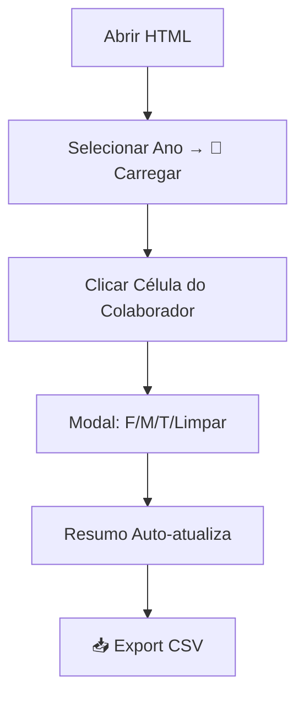

# Mapa de Férias - Auchan & Closer Team

Mapa interativo de férias para planeamento da equipa de Data (**João Coelho**, **Newton Filho**, **Ricardo Nunes**, **Wallace Lindemberg**). Permite marcar férias, visualizar feriados nacionais portugueses e exportar relatórios CSV.

## ✨ **Funcionalidades Principais**

- **Visualização Timeline**: Calendário anual com meses, dias, fins-de-semana e feriados destacados
- **Marcação One-Click**: Clique em qualquer célula → modal → **F/M/T** ou limpar
- **Feriados Automáticos**: Todos os feriados PT 2026+ (fixos + Páscoa/Corpus Christi dinâmicos)
- **Resumo Automático**: Férias anteriores, disponíveis (22/ano), gozadas e por marcar
- **Persistência Local**: Dados guardados no browser por ano
- **Export CSV**: Download imediato com todos os cálculos
- **Multi-Ano**: 2026-2030 com dados independentes

## 🎨 **Legenda Visual**

| Código | Significado | Cor |
|--------|-------------|-----|
| **F** | Dia completo de férias | 🟢 Verde escuro |
| **M** | Meio-dia manhã | 🟩 Verde claro |
| **T** | Meio-dia tarde | 🟡 Amarelo |
| 🔴🟣🟢 | Feriados nacionais | 🔴 Vermelho |
| 📅 | Fins-de-semana | ⬜ Cinza claro |
| (vazio) | Dia normal disponível | ⚪ Branco |

**Feriados 2026**: Ano Novo (01/01), Liberdade (25/04), Trabalhador (01/05), Portugal (10/06), Assunção (15/08), República (05/10), Todos Santos (01/11), Restauração (01/12), Imaculada (08/12), Natal (25/12), Sexta Santa (03/04), Páscoa (05/04), Corpus Christi (04/06).

## 🚀 **Como Usar**



1. **Abrir** ficheiro HTML no browser
2. **Ano** → **🔄 Carregar Ano**
3. **Clique** numa célula do colaborador
4. **Escolher**: `📆 F Completo` / `☀️ M Manhã` / `🌅 T Tarde` / `✨ Limpar`
5. **Editar** "Férias Ant." clicando na coluna
6. **📥 Exportar CSV** ou **🗑️ Limpar Tudo**

## 🧮 **Cálculos Automáticos**

```
Total Disponível = Férias Anteriores + 22 (anual)
Gozadas (F) = Dias F completos
Marcadas (M+T) = 0.5 × (M + T)
Por Marcar = Total - Gozadas - Marcadas
```

**Stats atualizam em tempo real.**

## 🔧 **Desenvolvimento & Manutenção**

| Aspecto | Detalhes |
|---------|----------|
| **Tech** | HTML5, CSS3 (gradientes/sticky), Vanilla JS |
| **Dados** | `dados[colab][YYYY-MM-DD]` + `feriasAnteriores[colab]` |
| **Storage** | `localStorage` (`mapaFerias_${ano}`) |
| **Responsive** | Desktop + Mobile |
| **Customizações** | Editar `colaboradores[]`, `ferAno = 22` |

**Correção aplicada**: Data no modal usa `new Date(dateStr)` para precisão one-click.

## 📋 **Estrutura de Dados**

```javascript
// Exemplo
dados = {
  "João Coelho": {
    "2026-01-15": "F",
    "2026-07-20": "M"
  }
}
feriasAnteriores = {
  "João Coelho": 5
}
```

## 📈 **Exemplo Resumo**

| Colaborador | Férias Ant. | Férias 2026 | Total Disp. | Gozadas (F) | Marcadas (M+T) | Por Marcar |
|-------------|-------------|-------------|-------------|-------------|----------------|------------|
| João Coelho | **5** | 22 | **27** | 8 | 3.5 | **15.5** |

## 🗃️ **Histórico do Projeto**

- **Criado**: Planeamento Auchan Data Team (Portugal, 2026)
- **Equipa**: João Coelho, Newton Filho, Ricardo Nunes, Wallace Lindemberg
- **Evolução**: Suporte multi-ano + feriados dinâmicos

**Para issues/melhorias**: Contactar Data Lead.  
**Licença**: Uso interno Auchan Team.

***

*Última actualização: 16 Jan 2026*  
*Versão: 2.0 (Data One-Click Fix)*
